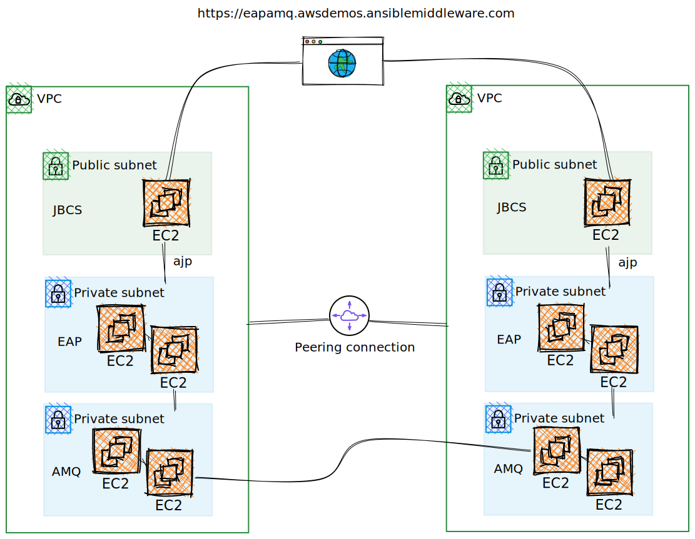

# aws-eapamq-demo

This repository contains reference configurations that can create resourses on AWS and deploy on it with all the required configurations.

The final architecture looks like:




## Prerequisites

* Red Hat Enterprise Linux (RHEL) 8 controller host (or Fedora works too)
* Ansible >= 2.11 / python >= 3.9
* python dependencies installed on the controller host `pip install -r requirements.txt`
* AWS-CLI installed on the controller host 'dnf install aws-cli'
* All the default parmeters for AWS cloud instances are provided in `roles/aws/defaults/main.yml`
* if exposing the loadbalancer publicly, the TLS certificate and key in the files/ directory, named _public_fqdn_.key and _public_fqdn_.crt
* We are using dynamic inventory provided by AWS. Once the instances are created you can view it by `ansible-inventory -i inventory/myaws_ec2.yml --graph`

### Install Ansible Dependencies

`ansible-galaxy collection install -r requirements.yml`

## Running on AWS cloud

### Infrastracture

1. Create a var-file containing your RHN credentials:
```
$ cat rhn-creds.yml
rhn_username: '<username>'
rhn_password: '<password>'
```

2. Execute the main play:
```
ansible-playbook -e @rhn-creds.yml infra.yml
```
Note: open `ansible.cfg` config file and edit `remote_user` and `remote_privkey` accordingly to your configuration.


### Service deployment

```
ansible-playbook -e @rhn-creds.yml deploy.yml
```

## License

Apache License v2.0 or later

See [LICENCE](LICENSE) to view the full text.


## Authors

* Harsha Cherukuri <hcheruku@redhat.com>
* Guido Grazioli <ggraziol@redhat.com>
